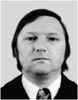

+++
title='Академики-выпускники кафедры'
date = 2020-09-09T21:52:39+03:00
draft = false
categories = ['history']
toc = false
+++


<table class="contentpaneopen">
<tbody>
<tr>
<td class="contentheading" width="100%">
<h4>Афанасьев А.М.</h4>
</td>
</tr>
</tbody>
</table>
<table class="contentpaneopen">
<tbody>
<tr>
<td colspan="2" valign="top">
<table border="0">
<tbody>
<tr>
<td>

</td>
<td valign="top">

<a href="http://dic.academic.ru/dic.nsf/enc_biography/6577/%D0%90%D1%84%D0%B0%D0%BD%D0%B0%D1%81%D1%8C%D0%B5%D0%B2" target="_blank" rel="noopener noreferrer">Афанасьев А.М.</a>, чл.-корр. РАН, выпускник 1961 г.

</td>
</tr>
</tbody>
</table>
</td>
</tr>
</tbody>
</table>

<table class="contentpaneopen">
<tbody>
<tr>
<td class="contentheading" width="100%">
<h4>Балдин А.М.</h4>
</td>
</tr>
</tbody>
</table>
<table class="contentpaneopen">
<tbody>
<tr>
<td colspan="2" valign="top">
<table border="0">
<tbody>
<tr>
<td>

</td>
<td valign="top">

<a href="http://ru.wikipedia.org/wiki/%D0%91%D0%B0%D0%BB%D0%B4%D0%B8%D0%BD,_%D0%90%D0%BB%D0%B5%D0%BA%D1%81%D0%B0%D0%BD%D0%B4%D1%80_%D0%9C%D0%B8%D1%85%D0%B0%D0%B9%D0%BB%D0%BE%D0%B2%D0%B8%D1%87" target="_blank" rel="noopener noreferrer">Балдин А.М.</a>, академик,  выпускник 1949 г.

</td>
</tr>
</tbody>
</table>
</td>
</tr>
</tbody>
</table>

<table class="contentpaneopen">
<tbody>
<tr>
<td class="contentheading" width="100%">
<h4>Басов Н.Г.</h4>
</td>
</tr>
</tbody>
</table>
<table class="contentpaneopen">
<tbody>
<tr>
<td valign="top">
<table style="height: 260px;" border="0" width="409">
<tbody>
<tr>
<td style="width: 200px;">

</td>
<td style="width: 193px;" valign="top">

<a href="http://ru.wikipedia.org/wiki/%D0%91%D0%B0%D1%81%D0%BE%D0%B2,_%D0%9D%D0%B8%D0%BA%D0%BE%D0%BB%D0%B0%D0%B9_%D0%93%D0%B5%D0%BD%D0%BD%D0%B0%D0%B4%D0%B8%D0%B5%D0%B2%D0%B8%D1%87" target="_blank" rel="noopener noreferrer">Басов Н.Г.</a>, академик,  лауреат Нобелевской премии,  выпускник 1949 г.

 

</td>
</tr>
</tbody>
</table>
</td>
</tr>
</tbody>
</table>

<table class="contentpaneopen">
<tbody>
<tr>
<td class="contentheading" width="100%">
<h4>Белавин А.А.</h4>
</td>
</tr>
</tbody>
</table>
<table class="contentpaneopen">
<tbody>
<tr>
<td colspan="2" valign="top">
<table border="0">
<tbody>
<tr>
<td>

</td>
<td valign="top">

<a href="http://www.ras.ru/win/db/show_per.asp?P=.id-61971.ln-ru">Белавин А.А.</a>, член-корреспондент РАН,  выпускник 1967 г.

</td>
</tr>
</tbody>
</table>
</td>
</tr>
</tbody>
</table>

<table class="contentpaneopen">
<tbody>
<tr>
<td class="contentheading" width="100%">
<h4>Галицкий В.М.</h4>
</td>
</tr>
</tbody>
</table>
<table class="contentpaneopen">
<tbody>
<tr>
<td colspan="2" valign="top">
<table border="0">
<tbody>
<tr>
<td>

</td>
<td valign="top">

<a href="http://ufn.ru/ru/articles/1981/5/g/" target="_blank" rel="noopener noreferrer">Галицкий В.М</a>., чл.-корр. АН СССР, выпускник 1949 г.

</td>
</tr>
</tbody>
</table>
</td>
</tr>
</tbody>
</table>

<table class="contentpaneopen">
<tbody>
<tr>
<td class="contentheading" width="100%">
<h4>Горьков Л.П.</h4>
</td>
</tr>
</tbody>
</table>
<table class="contentpaneopen">
<tbody>
<tr>
<td colspan="2" valign="top">
<table border="0">
<tbody>
<tr>
<td>

</td>
<td valign="top">

<a href="http://ru.wikipedia.org/wiki/%D0%93%D0%BE%D1%80%D1%8C%D0%BA%D0%BE%D0%B2,_%D0%9B%D0%B5%D0%B2_%D0%9F%D0%B5%D1%82%D1%80%D0%BE%D0%B2%D0%B8%D1%87" target="_blank" rel="noopener noreferrer">Горьков Л.П</a>., академик,  выпускник 1953 г.

</td>
</tr>
</tbody>
</table>
</td>
</tr>
</tbody>
</table>

<table class="contentpaneopen">
<tbody>
<tr>
<td class="contentheading" width="100%">
<h4>Каган М.Ю.</h4>
</td>
</tr>
</tbody>
</table>
<table class="contentpaneopen">
<tbody>
<tr>
<td colspan="2" valign="top">
<table border="0">
<tbody>
<tr>
<td>

</td>
<td valign="top">

<a href="http://www.ras.ru/win/db/show_per.asp?P=.id-58615.ln-ru" target="_blank" rel="noopener noreferrer">М.Ю. Каган</a>, чл.-корр. РАН, выпускник 1984 г.

</td>
</tr>
</tbody>
</table>
</td>
</tr>
</tbody>
</table>

<table class="contentpaneopen">
<tbody>
<tr>
<td class="contentheading" width="100%">
<h4>Каган Ю.М.</h4>
</td>
</tr>
</tbody>
</table>
<table class="contentpaneopen">
<tbody>
<tr>
<td colspan="2" valign="top">
<table border="0">
<tbody>
<tr>
<td>

</td>
<td valign="top">

<a href="http://ru.wikipedia.org/wiki/%D0%9A%D0%B0%D0%B3%D0%B0%D0%BD_%D0%AE._%D0%9C." target="_blank" rel="noopener noreferrer">Каган Ю.М</a>., академик,  выпускник 1950 г.

</td>
</tr>
</tbody>
</table>
</td>
</tr>
</tbody>
</table>

<table class="contentpaneopen">
<tbody>
<tr>
<td class="contentheading" width="100%">
<h4>Кайдалов А.Б.</h4>
</td>
</tr>
</tbody>
</table>
<table class="contentpaneopen">
<tbody>
<tr>
<td colspan="2" valign="top">
<table border="0">
<tbody>
<tr>
<td>

</td>
<td valign="top">

<a href="http://ufn.ru/ru/authors/kaidalov_a_b/">Кайдалов А.Б.</a>, чл.-корр. РАН,  выпускник 1963 г.

</td>
</tr>
</tbody>
</table>
</td>
</tr>
</tbody>
</table>

<table class="contentpaneopen">
<tbody>
<tr>
<td class="contentheading" width="100%">
<h4>Ларкин А.И.</h4>
</td>
</tr>
</tbody>
</table>
<table class="contentpaneopen">
<tbody>
<tr>
<td colspan="2" valign="top">
<table border="0">
<tbody>
<tr>
<td>

</td>
<td valign="top">

<a href="http://ru.wikipedia.org/wiki/%D0%9B%D0%B0%D1%80%D0%BA%D0%B8%D0%BD,_%D0%90%D0%BD%D0%B0%D1%82%D0%BE%D0%BB%D0%B8%D0%B9_%D0%98%D0%B2%D0%B0%D0%BD%D0%BE%D0%B2%D0%B8%D1%87" target="_blank" rel="noopener noreferrer">Ларкин А.И</a>., академик, выпускник 1957 г.

</td>
</tr>
</tbody>
</table>
</td>
</tr>
</tbody>
</table>

<table class="contentpaneopen">
<tbody>
<tr>
<td class="contentheading" width="100%">
<h4>Михайлов В.Н.</h4>
</td>
</tr>
</tbody>
</table>
<table class="contentpaneopen">
<tbody>
<tr>
<td colspan="2" valign="top">
<table border="0">
<tbody>
<tr>
<td>

</td>
<td valign="top">

<a href="http://www.vniief.ru/vniief/udate/mvn.html" target="_blank" rel="noopener noreferrer">Михайлов В.Н.</a>, академик,  выпускник 1958 г.

</td>
</tr>
</tbody>
</table>
</td>
</tr>
</tbody>
</table>

<table class="contentpaneopen">
<tbody>
<tr>
<td class="contentheading" width="100%">
<h4>Незнамов В.П.</h4>
</td>
</tr>
</tbody>
</table>
<table class="contentpaneopen">
<tbody>
<tr>
<td colspan="2" valign="top">
<table border="0">
<tbody>
<tr>
<td>

</td>
<td valign="top">

<a href="http://www.ras.ru/win/db/show_per.asp?P=.id-61972.ln-ru">Незнамов В.П.</a>, член-корреспондент РАН,  выпускник 1968 г.

</td>
</tr>
</tbody>
</table>
</td>
</tr>
</tbody>
</table>

<table class="contentpaneopen">
<tbody>
<tr>
<td class="contentheading" width="100%">
<h4>Окунь Л.Б.</h4>
</td>
</tr>
</tbody>
</table>
<table class="contentpaneopen">
<tbody>
<tr>
<td colspan="2" valign="top">
<table border="0">
<tbody>
<tr>
<td>

</td>
<td valign="top">

<a href="http://ru.wikipedia.org/wiki/%D0%9E%D0%BA%D1%83%D0%BD%D1%8C,_%D0%9B%D0%B5%D0%B2_%D0%91%D0%BE%D1%80%D0%B8%D1%81%D0%BE%D0%B2%D0%B8%D1%87" target="_blank" rel="noopener noreferrer">Окунь Л.Б.</a>, академик, выпускник 1953 г.

</td>
</tr>
</tbody>
</table>
</td>
</tr>
</tbody>
</table>

<table class="contentpaneopen">
<tbody>
<tr>
<td class="contentheading" width="100%">
<h4>Рыкованов Г.Н.</h4>
</td>
</tr>
</tbody>
</table>
<table class="contentpaneopen">
<tbody>
<tr>
<td colspan="2" valign="top">
<table border="0">
<tbody>
<tr>
<td>

</td>
<td valign="top">

<a href="http://viperson.ru/wind.php?ID=197036" target="_blank" rel="noopener noreferrer">Рыкованов Г.Н.</a>, чл.-корр. РАН, выпускник 1977 г.

</td>
</tr>
</tbody>
</table>
</td>
</tr>
</tbody>
</table>

<table class="contentpaneopen">
<tbody>
<tr>
<td class="contentheading" width="100%">
<h4>Файнберг В.Я.</h4>
</td>
</tr>
</tbody>
</table>
<table class="contentpaneopen">
<tbody>
<tr>
<td colspan="2" valign="top">
<table border="0">
<tbody>
<tr>
<td>

</td>
<td valign="top">

<a href="http://hep.phys.msu.ru/about/professors.phtml?id=20" target="_blank" rel="noopener noreferrer">Файнберг В.Я</a>.,чл.-корр. РАН, выпускник 1949 г.

</td>
</tr>
</tbody>
</table>
</td>
</tr>
</tbody>
</table>

<table class="contentpaneopen">
<tbody>
<tr>
<td class="contentheading" width="100%">
<h4>Чизмаджев Ю.А.</h4>
</td>
</tr>
</tbody>
</table>
<table class="contentpaneopen">
<tbody>
<tr>
<td colspan="2" valign="top">
<table border="0">
<tbody>
<tr>
<td>

</td>
<td valign="top">

<a href="http://www.registry.biophys.msu.ru/person?Serial=74259" target="_blank" rel="noopener noreferrer">Чизмаджев Ю.А</a>., чл.-корр. РАН, выпускник 1956 г.

</td>
</tr>
</tbody>
</table>
</td>
</tr>
</tbody>
</table>

