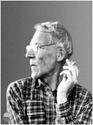
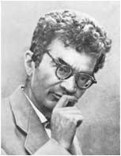
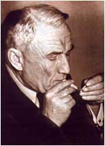
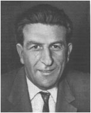

+++
title='Первые преподаватели кафедры'
date = 2020-09-09T21:51:39+03:00
draft = false
categories = ['history']
toc = false
+++



<table class="contentpaneopen">
<tbody>
<tr>
<td class="contentheading" width="100%">
<h4>Леонтович М.А.</h4>
</td>
</tr>
</tbody>
</table>
<table class="contentpaneopen">
<tbody>
<tr>
<td colspan="2" valign="top">
<table border="0">
<tbody>
<tr>
<td>

</td>
<td valign="top">

<a href="http://ru.wikipedia.org/wiki/%D0%9B%D0%B5%D0%BE%D0%BD%D1%82%D0%BE%D0%B2%D0%B8%D1%87,_%D0%9C%D0%B8%D1%85%D0%B0%D0%B8%D0%BB_%D0%90%D0%BB%D0%B5%D0%BA%D1%81%D0%B0%D0%BD%D0%B4%D1%80%D0%BE%D0%B2%D0%B8%D1%87" target="_blank" rel="noopener noreferrer">Михаил Александрович Леонтович</a> (1903-1981), академик.  «Из отдельных отрывочных воспоминаний возникает непов- торимый образ Михаила Александровича Леонтовича –  большого ученого, обладающего огромной эрудицией, и  простого доступного человека…»  Академик А.М.Обухов

</td>
</tr>
</tbody>
</table>
</td>
</tr>
</tbody>
</table>

 

<table class="contentpaneopen">
<tbody>
<tr>
<td class="contentheading" width="100%">
<h4>Померанчук И.Я.</h4>
</td>
</tr>
</tbody>
</table>
<table class="contentpaneopen">
<tbody>
<tr>
<td colspan="2" valign="top">
<table border="0">
<tbody>
<tr>
<td>

</td>
<td valign="top">

<a href="http://ru.wikipedia.org/wiki/%D0%9F%D0%BE%D0%BC%D0%B5%D1%80%D0%B0%D0%BD%D1%87%D1%83%D0%BA,_%D0%98%D1%81%D0%B0%D0%B0%D0%BA_%D0%AF%D0%BA%D0%BE%D0%B2%D0%BB%D0%B5%D0%B2%D0%B8%D1%87" target="_blank" rel="noopener noreferrer">Исаак Яковлевич Померанчук</a>(1913-1966), академик.  «Открытие Померанчуком синхротронного излучения, а  также предложенный им метод получения подкельвиновых  температур … должны были быть увенчаны Нобелевской  премией, любое из них, по выбору.»  Член-корреспондент АН СССР И.И.Гуревич

</td>
</tr>
</tbody>
</table>
</td>
</tr>
</tbody>
</table>
<h4> </h4>
<table class="contentpaneopen">
<tbody>
<tr>
<td class="contentheading" width="100%">
<h4>Тамм И.Е.</h4>
</td>
</tr>
</tbody>
</table>
<table class="contentpaneopen">
<tbody>
<tr>
<td colspan="2" valign="top">
<table border="0">
<tbody>
<tr>
<td>

</td>
<td valign="top">

<a href="http://ru.wikipedia.org/wiki/%D0%A2%D0%B0%D0%BC%D0%BC,_%D0%98%D0%B3%D0%BE%D1%80%D1%8C_%D0%95%D0%B2%D0%B3%D0%B5%D0%BD%D1%8C%D0%B5%D0%B2%D0%B8%D1%87" target="_blank" rel="noopener noreferrer">Игорь Евгеньевич Тамм</a> (1895-1971), академик, лауреат  Нобелевской премии, первый заведующий кафедрой.  «...Было (в России конца ХIХ века) нечто основное, самое  важное и добротное - среднеобеспеченная трудовая  интеллигенция с твердыми устоями духовного мира, из  кото-рой выходили и революционеры до мозга костей, и  поэты, и практические инженеры, убежденные, что самое  важное - это строить, делать полезное. Игорь Евгеньевич как  личность происходит именно отсюда, и лучшие родовые  черты этой интеллигенции стали лучшими его чертами, а ее  недостатки - и его слабостями.»  Академик Е.Л.Фейнберг

</td>
</tr>
</tbody>
</table>
</td>
</tr>
</tbody>
</table>
<h4> </h4>
<table class="contentpaneopen">
<tbody>
<tr>
<td class="contentheading" width="100%">
<h4>Фейнберг Е.Л.</h4>
</td>
</tr>
</tbody>
</table>
<table class="contentpaneopen">
<tbody>
<tr>
<td colspan="2" valign="top">
<table border="0">
<tbody>
<tr>
<td>

</td>
<td valign="top">

<a href="http://ru.wikipedia.org/wiki/%D0%A4%D0%B5%D0%B9%D0%BD%D0%B1%D0%B5%D1%80%D0%B3,_%D0%95%D0%B2%D0%B3%D0%B5%D0%BD%D0%B8%D0%B9_%D0%9B%D1%8C%D0%B2%D0%BE%D0%B2%D0%B8%D1%87" target="_blank" rel="noopener noreferrer">Фейнберг Евгений Львович</a> , (1912 - 2006), академик.  «…Невозможно даже упомянуть о всех работах  Е.Л.Фейнберга и всех полученных им результатах. Их полное  перечисление все равно не отразило бы широту интересов  Евгения Львовича, охватывающих наряду с наукой также и  литературу, музыку, искусствоведения.» УФН, 2002 г.

</td>
</tr>
</tbody>
</table>
</td>
</tr>
</tbody>
</table>

 

