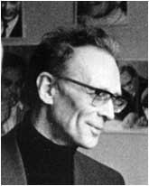
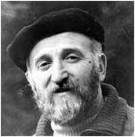
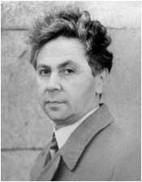
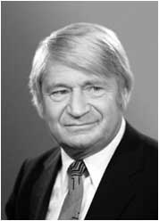
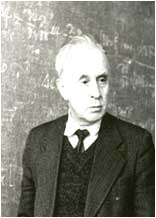
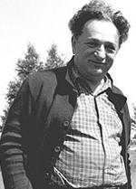
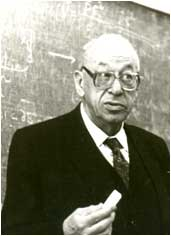
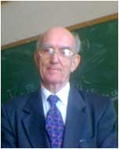

+++
title = 'В разное время на кафедре работали'
date = 2020-09-09T21:54:39+03:00
draft = false
categories = ['history']
toc = false
+++


<table>
<tbody>
<tr>
<td class="contentheading" width="100%">
<h4>Беляев С.Т.</h4>
</td>
</tr>
</tbody>
</table>
<table>
<tbody>
<tr>
<td colspan="2" valign="top">
<table border="0">
<tbody>
<tr>
<td>

</td>
<td valign="top">

Академик <a href="http://ru.wikipedia.org/wiki/%D0%91%D0%B5%D0%BB%D1%8F%D0%B5%D0%B2,_%D0%A1%D0%BF%D0%B0%D1%80%D1%82%D0%B0%D0%BA_%D0%A2%D0%B8%D0%BC%D0%BE%D1%84%D0%B5%D0%B5%D0%B2%D0%B8%D1%87" target="_blank" rel="noopener noreferrer"> Спартак Тимофеевич Беляев</a>  (род. 1923 г.)

 

Академик Спартак Тимофеевич Беляев (род. 1923 г.) «Спартака Тимофеевича можно без малейших преувеличений охарактеризовать словом «первый». Он в числе первого выпуска Физтеха (тогда, в 1952 году — еще факультета МГУ). Он первый академик из числа выпускников Физтеха. Он лауреат первой медали имени Л. Д. Ландау. Он — признанный авторитет во многих направлениях физики.»

 

Ю. М. Белоусов, зав. кафедрой теоретической физики Физтеха

 

 

</td>
</tr>
</tbody>
</table>
</td>
</tr>
</tbody>
</table>

<table>
<tbody>
<tr>
<td class="contentheading" width="100%">
<h4>Будкер А.М.</h4>
</td>
</tr>
</tbody>
</table>
<table>
<tbody>
<tr>
<td colspan="2" valign="top">
<table border="0">
<tbody>
<tr>
<td>

</td>
<td valign="top">

Академик <a href="http://www.sibai.ru/content/view/1525/1681/" target="_blank" rel="noopener noreferrer"> Андрей Михайлович Будкер</a>  (1918-1977).

 

Академик Будкер Андрей Михайлович (1918-1977). «Могучий талант, глубокое и тонкое понимание физики, смелое и оригина-льное мышление, необыкновенная научная фантазия - это только некоторые определения, данные ему в разное время известными учеными-коллегами - российскими и зарубежными.

 

А.Кудрявцев, ученый секретарь ИЯФ им Г.И.Будкера

 

</td>
</tr>
</tbody>
</table>
</td>
</tr>
</tbody>
</table>
<table>
<tbody>
<tr>
<td class="contentheading" width="100%">
<h4>Компанеец А.С.</h4>
</td>
</tr>
</tbody>
</table>
<table>
<tbody>
<tr>
<td colspan="2" valign="top">
<table border="0">
<tbody>
<tr>
<td>

</td>
<td valign="top">

Профессор <a href="http://ufn.ru/ru/articles/1974/12/e/" target="_blank" rel="noopener noreferrer"> Компанеец Александр Соломонович</a>  (1914-1974).

 

Профессор Компанеец Александр Соломонович (1914-1974). «В создании Школы Ландау сдача экзаменов, программу которых разработал Ландау, играла важную роль. Список сдавших теорми-нимум, написанный рукой Ландау, сохранился. В этом списке, в котором 43 фамилии, первой стоит фамилия А.С. Компанейца.» Профессор М.И.Каганов

 

 

 

 

</td>
</tr>
</tbody>
</table>
</td>
</tr>
</tbody>
</table>
<table>
<tbody>
<tr>
<td class="contentheading" width="100%">
<h4>Мигдал А.Б.</h4>
</td>
</tr>
</tbody>
</table>
<table>
<tbody>
<tr>
<td colspan="2" valign="top">
<table border="0">
<tbody>
<tr>
<td>

</td>
<td valign="top">

Академик <a href="http://ru.wikipedia.org/wiki/%D0%9C%D0%B8%D0%B3%D0%B4%D0%B0%D0%BB,_%D0%90%D1%80%D0%BA%D0%B0%D0%B4%D0%B8%D0%B9_%D0%91%D0%B5%D0%B9%D0%BD%D1%83%D1%81%D0%BE%D0%B2%D0%B8%D1%87" target="_blank" rel="noopener noreferrer"> Мигдал Аркадий Бенедиктович</a>  (1911-1991).

 

Академик Мигдал Аркадий Бенедиктович (1911-1991). «АБ был очень многогранен в своих интересах и увлечениях. Искусство, спорт, общение c интересными ему людьми, казалось, занимали все его время. Причем любым увлечениям он отдавался с неистовством. Ярко вижу его на горном склоне, летящим вниз на плохо управляемых им лыжах под крики его молодых знакомых: «АБ, поберегите себя для науки!» Но он не мог беречь себя только для науки. И тем удивительнее, как много он для нее сделал.» Академик С.Т. Беляев

</td>
</tr>
</tbody>
</table>
</td>
</tr>
</tbody>
</table>
<table>
<tbody>
<tr>
<td class="contentheading" width="100%">
<h4>Силин В.П.</h4>
</td>
</tr>
</tbody>
</table>
<table>
<tbody>
<tr>
<td colspan="2" valign="top">
<table border="0">
<tbody>
<tr>
<td>

</td>
<td valign="top">

Член-корреспондент РАН  <a href="http://ufn.ru/ru/authors/silin_viktor_p/">Силин Виктор Павлович</a>(род. в 1926 г.).  «…как и в молодые годы, он увлеченно работает,  публикуя ежегодно по 10 научных работ…. Особую забо- ту В.П.Силин проявляет по отношению к научной молоде- жи, стараясь поддержать её и передать свой интерес и пре- данность науке.» (Физика плазмы, 2001 г.)  В настоящее время, как и в течение многих лет,  Виктор Павлович является профессором кафедры  теоретической физики НИЯУ МИФИ.

</td>
</tr>
</tbody>
</table>
</td>
</tr>
</tbody>
</table>
<table>
<tbody>
<tr>
<td class="contentheading" width="100%">
<h4>Смородинский Я.А.</h4>
</td>
</tr>
</tbody>
</table>
<table>
<tbody>
<tr>
<td colspan="2" valign="top">
<table border="0">
<tbody>
<tr>
<td>

</td>
<td valign="top">

Профессор <a href="http://ufn.ru/ru/articles/1993/2/h/" target="_blank" rel="noopener noreferrer">Смородинский Яков Абрамович</a> (1917-1992).  «Обладая поистине энциклопедическими познаниями и яр- ким темпераментом просветителя, он делился своим духов- ным богатством с огромной аудиторией.»  (УФН, 1993 г.)

</td>
</tr>
</tbody>
</table>
</td>
</tr>
</tbody>
</table>
<table>
<tbody>
<tr>
<td class="contentheading" width="100%">
<h4>Шапиро И.С.</h4>
</td>
</tr>
</tbody>
</table>
<table>
<tbody>
<tr>
<td colspan="2" valign="top">
<table border="0">
<tbody>
<tr>
<td>

</td>
<td valign="top">

Член-корреспондент РАН <a href="http://www.biografija.ru/show_bio.aspx?id=135795" target="_blank" rel="noopener noreferrer">Шапиро Иосиф Соломонович</a>  (1918-1999). «И.С.Шапиро - яркий представителем  физического стиля мышления, когда понимание проблемы  достигается сначала на «языке явлений» с широким  привлечением аналогий из различных областей физики…  Вместе с тем его физическая интуиция сочетается с  владением мощным математическим аппаратом, а широта  научного кругозора – с конкретностью результатов.»  <a href="http://ufn.ru/ru/articles/1988/11/f/"> УФН, 1988 г.</a>

</td>
</tr>
</tbody>
</table>
</td>
</tr>
</tbody>
</table>
<table>
<tbody>
<tr>
<td class="contentheading" width="100%">
<h4>Шафранов В.Д.</h4>
</td>
</tr>
</tbody>
</table>
<table>
<tbody>
<tr>
<td colspan="2" valign="top">
<table border="0">
<tbody>
<tr>
<td>

</td>
<td valign="top">

Академик <a href="http://ru.wikipedia.org/wiki/%D0%A8%D0%B0%D1%84%D1%80%D0%B0%D0%BD%D0%BE%D0%B2,_%D0%92%D0%B8%D1%82%D0%B0%D0%BB%D0%B8%D0%B9_%D0%94%D0%BC%D0%B8%D1%82%D1%80%D0%B8%D0%B5%D0%B2%D0%B8%D1%87">Шафранов Виталий Дмитриевич</a>(род. в 1929 г.)  «… в физике плазмы существует ряд терминов и понятий,  на-прямую связанных с именем Виталия Дмитриевича:  “крите-рий Крускала-Шафранова”, “уравнение Грэда- Шафранова”, “смещение Шафранова” и др. “Смещение  Шафранова” – это вообще первое, что узнает  экспериментатор, начинающий ра-ботать на токамаках.  Из поздравления к 75-летию.

</td>
</tr>
</tbody>
</table>
</td>
</tr>
</tbody>
</table>

 


