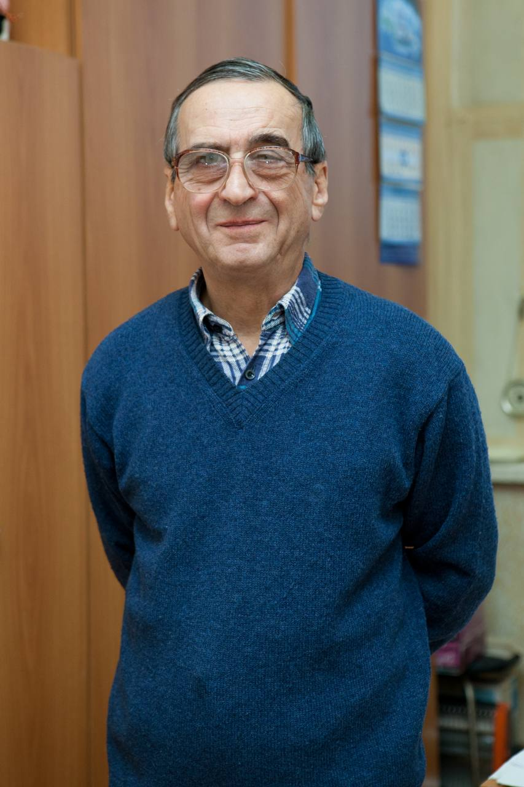

+++
slug='memory-of-chernov'
title = 'Памяти Александра Сергеевича Чернова'
date = 2024-04-04T12:00:00+03:00
draft = false
categories = ['other']
toc = false
+++

Сегодня исполнилось бы 80 лет Александру Сергеевичу Чернову (1944 – 2015) – одному из лучших преподавателей кафедры, ее символов. На его лекциях и семинарах самые сложные предметы – статфизика и даже макроскопическая электродинамика – становились вдруг не только интересными, но и удивительно понятными. Дар Чернова – придумывать и решать задачи по-настоящему непростые, полнокровные, извлеченные не из учебника, а из окружающего мира – от ранней Вселенной до переходных металлов, от термодинамики биосферы до макроэкономики – был как всякий большой талант непередаваем и неразложим на простые компоненты, но буквально физически ощутим всеми, кто оказывался рядом. Учиться у Чернова хотелось не только физике, а вообще всему: интеллигентности, мудрому спокойствию перед лицом испытаний, интеллектуальной честности… 

Александр Сергеевич, Вас сильно нам не хватает! И мы вспоминаем Вас часто