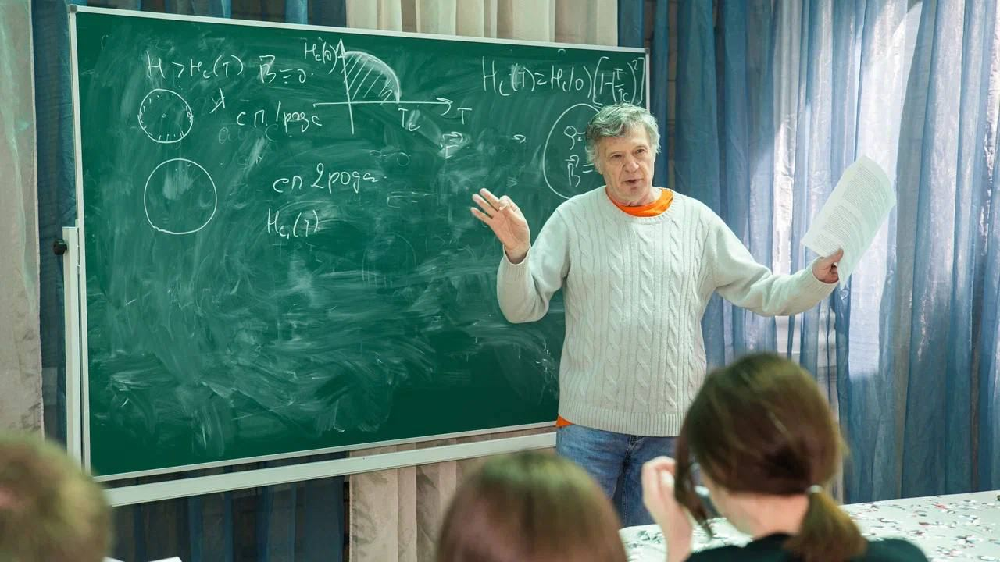
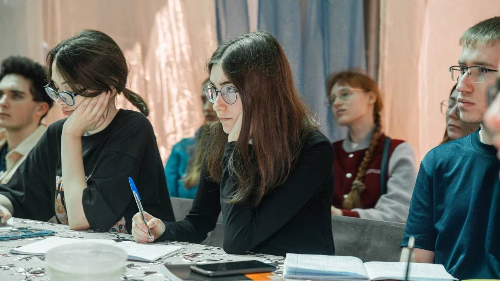
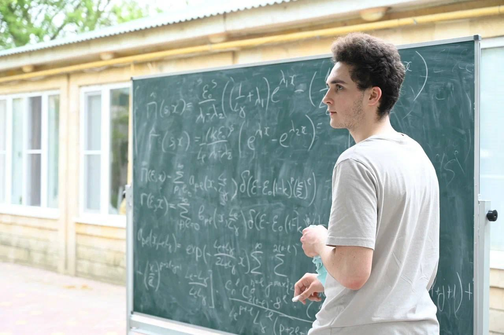
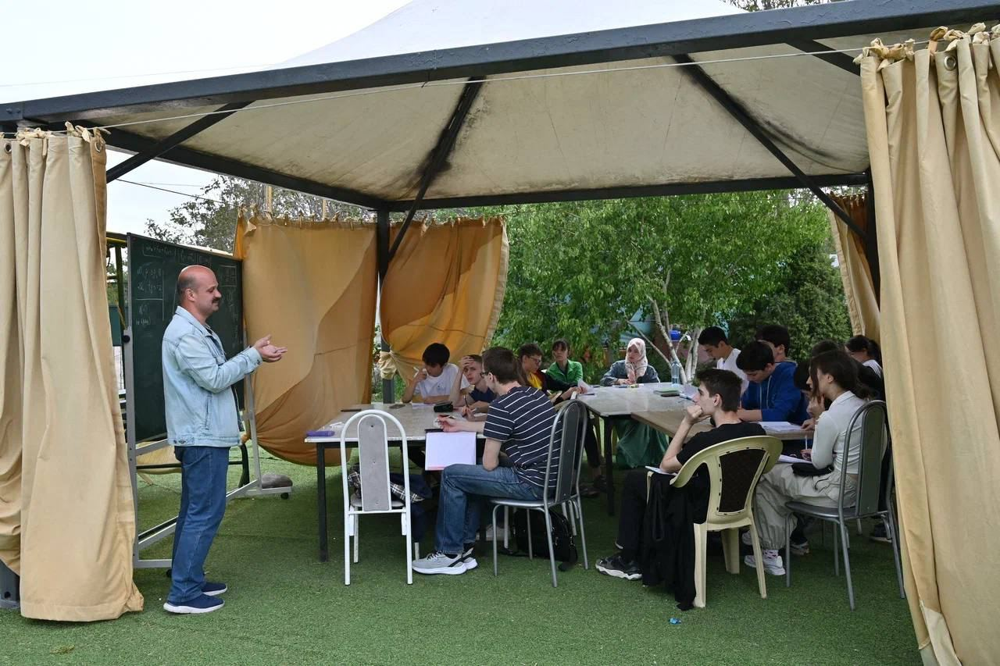
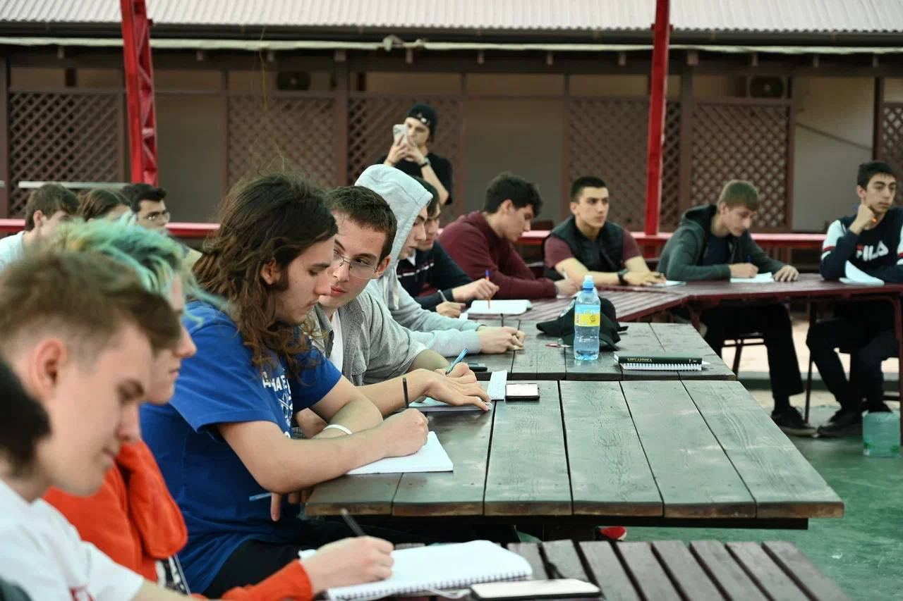

+++
slug='scs24-photos'
title = 'Несколько фотографий со Школы по фундаментальной физике и математике в Махачкале'
date = 2024-05-01T12:00:00+03:00
draft = false
categories = ['confs', 'study']
toc = false
+++

На некоторых можно увидеть мифистов, которых здесь в сумме 12. Закончился третий день занятий. Впереди – еще три. Выступления студентов – интересные и в основном неплохо подготовленные не только в части изложения, но и в ответах на вопросы. Атмосфера – приятная, море – красивое, но неожиданно холодное...

