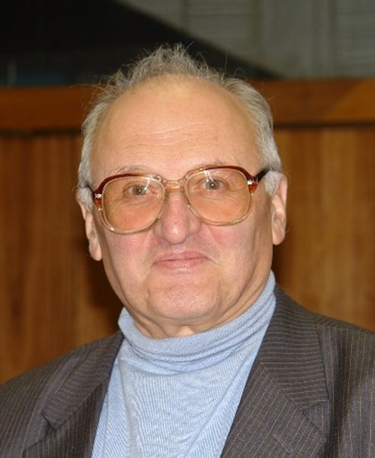

+++
slug='memory-of-lozovik'
title = 'Памяти Юрия Ефремовича Лозовика'
date = 2024-07-02T12:00:00+03:00
draft = false
categories = ['other']
toc = false
+++

Не стало Юрия Ефремовича Лозовика (1937–2024). Его имя давно неотделимо от *condensed matter*, а работы ЮЕ пронизывают эту область науки на протяжении десятилетий.  Всюду, где присутствовал ЮЕ – в Институте спектроскопии, «стекляшке» ИКИ, Вышке, институте Духова, на кафедре теофизики МИФИ, – он был центром притяжения для тех, кому интересны фаза Берри и сверхпроводимость, вигнеровские кристаллы и поляритоны, графен и наномашины, и еще многое и многое, из чего состоит почти бесконечная физика конденсированного состояния, удивительным образом полностью помещавшаяся в его голове. Человек-энциклопедия, создатель научной школы, воспитавшей десятки учеников, автор сотен работ, собравших многие тысячи цитирований, соавтор нобелевских лауреатов и идеолог экспериментов, ЮЕ не только академиком, но и доктором наук не был – нечастый случай абсолютного бескорыстия и равнодушия даже к чисто научной карьере. С его смертью физика конденсированного состояния потеряла уникального ученого и учителя, эксперта и коммуникатора.

