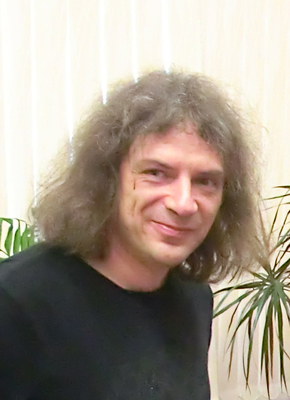

+++
title='Федотов Александр Михайлович'
# date = 2023-11-01T21:53:39+03:00
draft = false
# categories = ['staff']
+++

<!--  -->

**Должность**: доцент *Отделения лазерных и плазменных технологий офиса образовательных программ (412, ОФИС ОП(М) ОЛПТ)*

**Ученая степень**: кандидат физико-математических наук

**Ученое звание**: доцент

**Контакты**



*ауд.* К-408

*Email:* AMFedotov@mephi.ru

*Учебные курсы*:
- Общая теория относительности
- Теоретическая механика
- Теория поля
- Теория сверхсильных полей
- Статистическая физика 
- Современные проблемы теоретической физики
- Физика экстремальных световых полей и лазерной плазмы

**Данные о результатах научной и педагогической деятельности**:	
- [Scholar Google](https://scholar.google.com/citations?user=C5_mUIIAAAAJ&hl=ru&oi=sra)
- [WoS ResearcherID: L-4315-2016](https://www.webofscience.com/wos/author/record/L-4315-2016)
- [Scopus Author ID: 15061093500](https://www.scopus.com/authid/detail.uri?authorId=15061093500)
- [ORCID: 0000-0001-6182-516X](https://orcid.org/0000-0001-6182-516X)
- [РИНЦ](https://www.elibrary.ru/author_profile.asp?id=35477)

[*Персональная страница научно-педагогического работника НИЯУ МИФИ*](https://home.mephi.ru/ru/users/622/public)