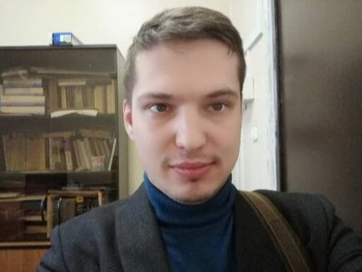

+++
title='Кондратьев Кирилл Александрович'
# date = 2023-11-01T21:53:39+03:00
draft = false
# categories = ['staff']
+++

**Должность**: ассистент *Отделения лазерных и плазменных технологий офиса образовательных программ (412, ОФИС ОП(М) ОЛПТ)*

**Контакты**



*ауд.* К-410

*Telegram.:* [@kakondratev](https://t.me/kakondratev)

*VK:* [Kirill Kondratyev](https://vk.com/id146790)

*Email:* <KAKondratyev@mephi.ru>

*Преподаваемые дисциплины:*
- Квантовая механика
- Статистическая физика
- Теоретическая механика
- Теория поля

[*Персональная страница научно-педагогического работника НИЯУ МИФИ*](https://home.mephi.ru/ru/users/749/public)