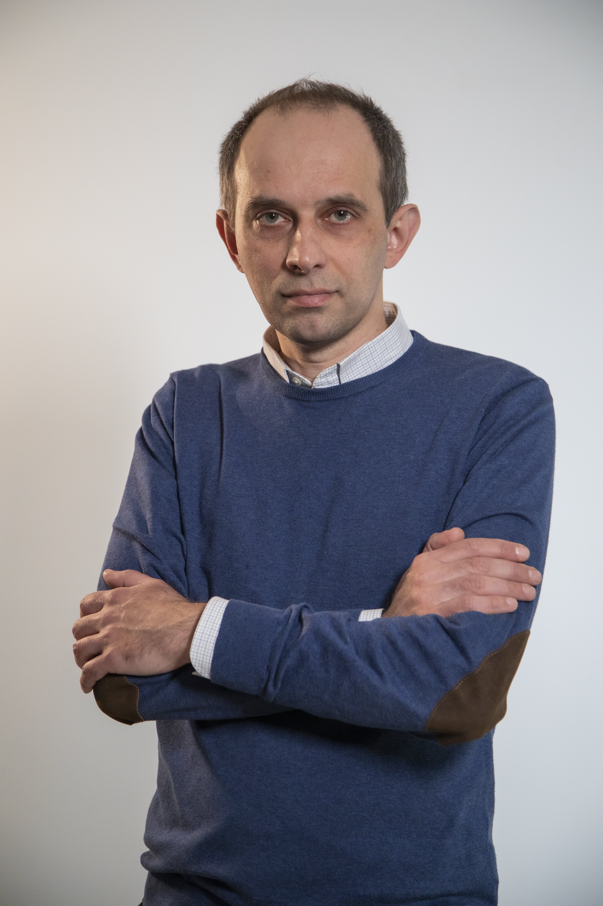

+++
title='Попруженко Сергей Васильевич'
# date = 2023-11-01T21:53:39+03:00
draft = false
# categories = ['staff']
+++

<!--  -->

**Должность**: заведующий кафедрой, ведущий научный сотрудник Института общей физики РАН им А.М. Прохорова

**Ученая степень**: доктор физико-математических наук

**Контакты**



*офис* НЛК 3.90

*Тел.:* +74957885699 (9376)

*Email:* <svpopruzhenko@mephi.ru>		       
        <sergey.popruzhenko@gmail.com>

*Учебные курсы*:
- Теоретическая механика 
- Теория поля
- Статистическая физика
- Спецсеминар

*Научные интересы*:	
- Взаимодействие сильных электромагнитных полей с веществом
- Нелинейная ионизация атомных систем
- Физика лазерной плазмы

Данные о результатах научной и педагогической деятельности	[CV](CV_poprz_2023.pdf), [Scholar Google](https://scholar.google.ru/citations?user=uCvoDYkAAAAJ&hl=en)

*Лекции по теоретической физике в МИФИ:*
- [Теоретическая механика](https://www.youtube.com/playlist?list=PLQVBExiz5DKDQy6fXVwgZQmpmPJZPp3Ys)
- [Теория поля](https://www.youtube.com/playlist?list=PLQVBExiz5DKAD6EWjhYrfPUZniwU08now)
- [Статистическая физика](https://www.youtube.com/playlist?list=PLQVBExiz5DKBrvsn-WC5tU8K91v0CO8dr)

*Научно-популярные материалы:*
- [Выпускники кафедры теорфизики МИФИ о себе и своей работе](https://www.youtube.com/watch?v=FDBQ40xLN7k&list=PLQVBExiz5DKA_hrgOQEoszagv0nB6Mym3)
- [Ярче миллиона сверхновых](https://www.youtube.com/watch?v=JBgjwDOB1tk&t=1459s). Лекция в фонде «Траектория»
- [Аттосекундная физика](https://www.youtube.com/watch?v=r4f1dmRv1MM&t=4s). Лекция в фонде «Траектория»
